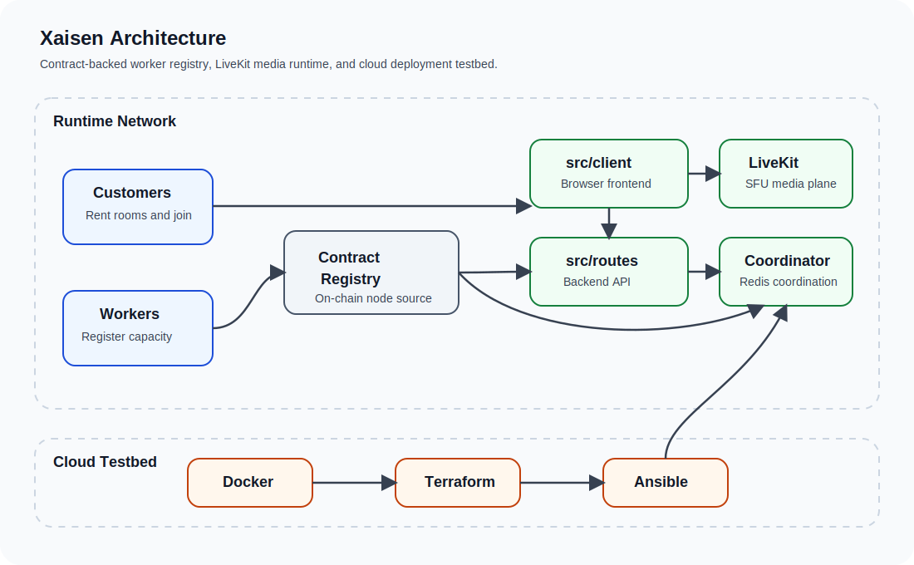

# Xaisen


A decentralized video conferencing platform powered by a contract-backed node registry.

## Overview

Xaisen connects customers who need video conference rooms with workers that provide the infrastructure for running them. The contract layer acts as the node registry, while the runtime layer handles conferencing, media routing, backend APIs, frontend UX, and Redis-backed coordination.



## Key Features

- Decentralized infrastructure model where workers register through an on-chain node registry.
- Rentable video conference rooms backed by registered worker capacity.
- LiveKit SFU media plane for real-time conferencing and WebRTC transport.
- Cloud testbed pipeline using Terraform, Ansible, and Docker for repeatable deployments.

## Quick Start

### Prerequisites

- Python 3.8+
- Terraform 1.6+
- Docker-compatible target hosts provisioned by Ansible
- Ansible 2.14+

```bash
git clone https://github.com/your-username/xaisen.git
cd xaisen
python3 vidctl.py --help
python3 vidctl.py deploy --provider aws --worker-nodes 1 --client-nodes 1 --coordinator-nodes 1
```

Provider credentials live in `secrets/cloud/<provider>.env`. Contract deployment metadata lives in `secrets/contract/<network>.env`, for example `secrets/contract/testnet.env` or `secrets/contract/mainnet.env`. Use [`vidctl.py deploy-contract`](docs/cli.md) to publish the Move package, then `vidctl.py init-contract` to create and store the shared registry object id.

## Documentation

### Operations & CLI

- [`docs/cli.md`](docs/cli.md) - CLI usage, credentials, and generated artifacts
- [`docs/IaC.md`](docs/IaC.md) - infrastructure overview and deployment pipeline

### Runtime Layer

- [`docs/src/contract.md`](docs/src/contract.md) - on-chain contract boundary
- [`docs/src/livekit.md`](docs/src/livekit.md) - LiveKit runtime layer
- [`docs/src/coordinator.md`](docs/src/coordinator.md) - Redis coordination layer
- [`docs/src/routes.md`](docs/src/routes.md) - backend routes service
- [`docs/src/client.md`](docs/src/client.md) - browser client

## Project Structure

### Operations & CLI

- [`IaC/`](IaC/) - cloud testbed infrastructure
- [`docs/`](docs/) - project documentation
- [`vidctl.py`](vidctl.py) - CLI orchestration entrypoint

### Runtime Layer

- [`src/contract/`](src/contract/) - node registry and on-chain coordination boundary
- [`src/livekit/`](src/livekit/) - SFU and media runtime
- [`src/coordinator/`](src/coordinator/) - Redis-backed coordination and dispatch layer
- [`src/routes/`](src/routes/) - backend API service
- [`src/client/`](src/client/) - browser frontend

## Contributing

- Keep changes aligned with the docs-first layout of the repository.
- Prefer updating the relevant document under `docs/` when behavior or architecture changes.
- Keep runtime code, contract boundaries, and cloud testbed concerns separated.

## License

MIT
