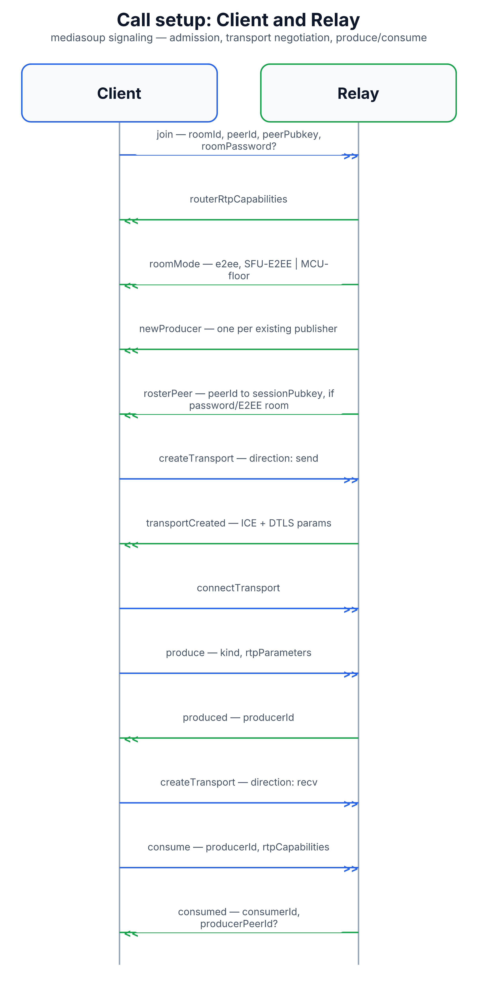

# Call Setup: Client and Relay

This is the protocol a browser actually speaks when it joins a call today.
It runs entirely between the **client** (the website) and the **relay**
(the worker that carries media, built on `mediasoup`) over a single
WebSocket. It covers everything from "let me into this room" through
"here's my camera and mic" to "here's everyone else's."

See also: [`end-to-end-encryption.md`](end-to-end-encryption.md) for the key
exchange that rides alongside this protocol in private rooms, and
[`relay-failover.md`](relay-failover.md) for what happens when the relay a
client is connected to goes down mid-call.

## Why this protocol exists

A call needs two things settled before any audio or video can flow: *who's
allowed in the room*, and *how does each browser's media reach the room*.
This protocol handles both. It deliberately does **not** carry the audio or
video itself — that travels over separate media connections the relay sets
up as a side effect of this signaling.

## Message flow

1. **`join`** — the client opens a WebSocket to the relay and sends a `join`
   message: `roomId`, a self-chosen `peerId`, its session public key
   (`peerPubkey`, a one-time identity for that call, unrelated to any
   wallet), and — only for rooms that require one — a `roomPassword`.
   - **First person in sets the password.** If nobody has joined this room
     yet, whoever joins first becomes its "host": their password becomes
     the room's password (stored as a hash, never as plain text), and their
     E2EE preference decides whether the room tries for end-to-end
     encryption at all. Everyone who joins after that must supply the same
     password.
   - Wrong passwords are rate-limited (10 attempts per minute per room by
     default) rather than locking the room, since it's a shared secret.
2. **`routerRtpCapabilities`** — the relay answers with the media formats
   (`mediasoup`'s "router capabilities") it can accept and forward. Every
   browser's WebRTC stack uses this to align its own media formats before
   sending anything.
3. **`roomMode`** — the relay tells the client whether this room is running
   in `SFU-E2EE` mode (each stream forwarded untouched, so end-to-end
   encryption can work) or `MCU-floor` mode (streams are mixed into one
   composite video server-side, which is incompatible with end-to-end
   encryption — the relay always reports `e2ee: false` in that mode, even
   if the host had asked for it, so nobody is misled about privacy).
4. **`newProducer`** (one per existing publisher) — the relay lists
   everyone already publishing audio/video in the room, so the newcomer
   knows what to expect.
5. **`rosterPeer`** (only in password-protected or E2EE rooms) — the relay
   tells the new peer every existing peer's session public key, and tells
   every existing peer the newcomer's key. This roster is what makes the
   end-to-end key exchange possible later — see
   [`end-to-end-encryption.md`](end-to-end-encryption.md).
6. **`createTransport`** (direction `send`) → **`transportCreated`** — the
   client asks the relay to open a media transport for *sending*; the relay
   replies with the ICE and DTLS connection details a browser needs to
   establish that transport (the same building blocks any WebRTC call
   uses).
7. **`connectTransport`** — the client finishes the handshake for that
   transport once its browser has its side ready. No reply is expected.
8. **`produce`** → **`produced`** — the client tells the relay it's about
   to send a track (audio or video, with its encoding parameters); the
   relay replies with a `producerId` identifying that track from now on.
   Video tracks are sent in three quality tiers (simulcast) so the relay
   can forward a lower tier to peers on weaker connections without
   re-encoding anything itself.
9. **`createTransport`** (direction `recv`) — the same dance as step 6, but
   for a transport that will *receive* other peers' media.
10. **`consume`** → **`consumed`** — the client asks to receive a specific
    `producerId`; the relay replies with everything needed to decode it.
    When the stream in question was forwarded in from a *different* relay
    (see [`inter-relay-warm-pipe.md`](inter-relay-warm-pipe.md)), the reply
    also includes `producerPeerId` — the identity of the original publisher,
    not just the relay-internal id — which the client needs to attribute
    the stream correctly for E2EE decryption.

From here on, the relay pushes a few more notifications as the call
continues: **`newProducer`** whenever someone else starts publishing,
**`peerLeft`** when someone disconnects, and **`activeSpeaker`** based on
who's currently talking (used for speaker-highlighting UI). The client can
also send **`pauseConsumer`** / **`resumeConsumer`** to stop/start receiving
a given stream, and **`setConsumerLayers`** to ask for a different
simulcast quality tier — the relay picks the encoded layer itself by
reading unencrypted packet headers; it never has to decrypt anything to do
this, which matters for the end-to-end encryption guarantee.

Leaving is either an explicit **`leave`** message or simply closing the
WebSocket — both trigger the same server-side cleanup and a `peerLeft`
broadcast to the rest of the room.

## Diagram

Diagram built from React source in [`docs/imgen/src/diagrams/proto-call-setup-relay.tsx`](../imgen/src/diagrams/proto-call-setup-relay.tsx) — run `pnpm build` in `docs/imgen/` to regenerate.

## Message reference

| Direction | Message | Carries |
|---|---|---|
| Client → Relay | `join` | `roomId`, `peerId`, `peerPubkey`, `roomPassword?`, `e2ee?` |
| Relay → Client | `routerRtpCapabilities` | supported media formats |
| Relay → Client | `roomMode` | `{ e2ee, mode }` |
| Relay → Client | `newProducer` | `peerId`, `producerId`, `kind` |
| Relay → Client | `rosterPeer` | `peerId`, `sessionPubkey` |
| Client → Relay | `createTransport` | `direction: 'send' \| 'recv'` |
| Relay → Client | `transportCreated` | `id`, ICE params, ICE candidates, DTLS params, `iceServers?` |
| Client → Relay | `connectTransport` | `transportId`, `dtlsParameters` |
| Client → Relay | `produce` | `transportId`, `kind`, `rtpParameters` |
| Relay → Client | `produced` | `producerId` |
| Client → Relay | `consume` | `producerId?`, `rtpCapabilities` |
| Relay → Client | `consumed` | `consumerId`, `producerId`, `kind`, `rtpParameters`, `producerPeerId?` |
| Client → Relay | `setConsumerLayers` | `consumerId`, `spatialLayer`, `temporalLayer?` |
| Client → Relay | `pauseConsumer` / `resumeConsumer` | `consumerId` |
| Relay → Client | `peerLeft` | `peerId` |
| Relay → Client | `activeSpeaker` | `peerId` |
| Client → Relay | `leave` | — |

## Security notes

- **Passwords are never stored or sent as plain text** on the relay side —
  only a SHA-256 hash is kept, and it's compared, not decrypted.
- **Wrong-password attempts are rate-limited**, not silently retried
  forever, to blunt guessing.
- **The relay never needs to decrypt media** to do its job — quality-tier
  selection reads only unencrypted RTP packet headers, which keeps it
  compatible with end-to-end encryption when that's active.
- **`roomMode` is enforced server-side, not just client-side** — a room
  that falls back to composite mixing (`MCU-floor`) always reports
  `e2ee: false`, even if a client asked for encryption, so a client can't
  be tricked into believing a mixed stream is still end-to-end encrypted.
