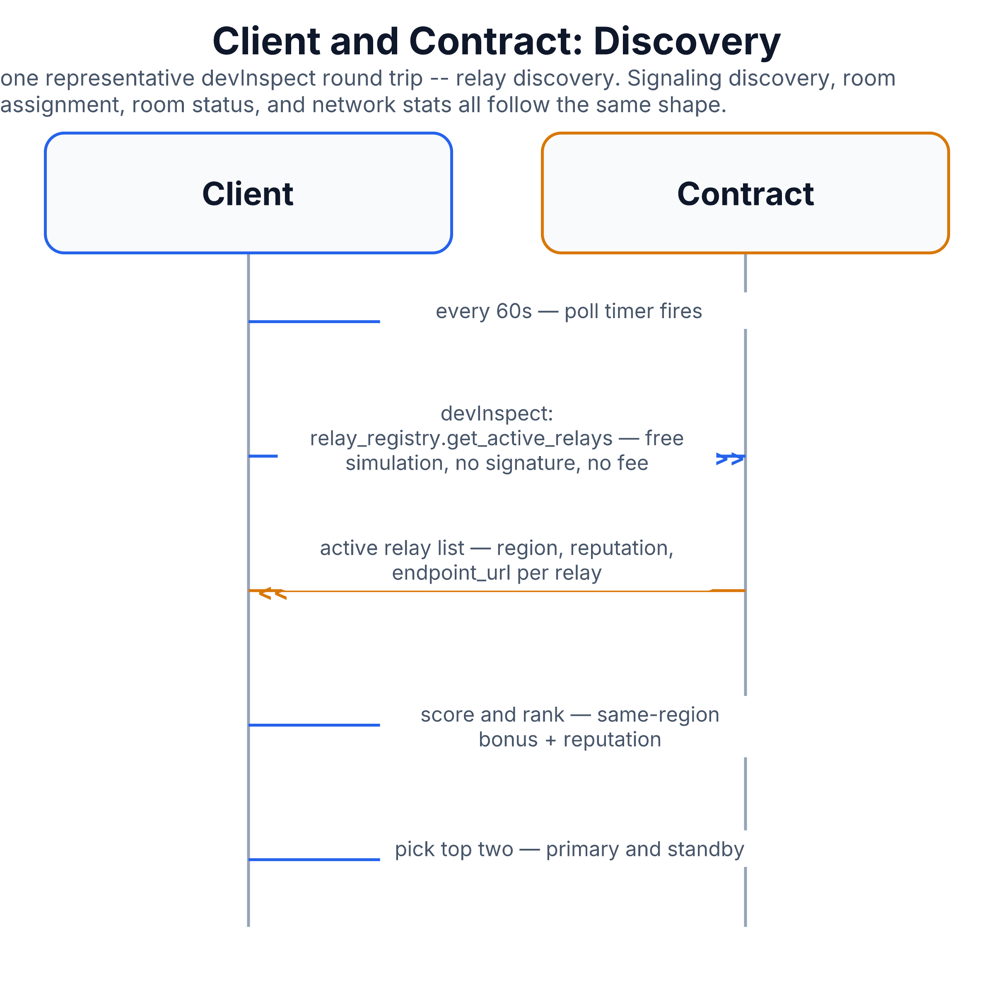

# Client and Contract: Discovery

This covers how the browser client finds things out from the blockchain
directly — no worker sits in between. It's less a "protocol between two
parties" in the usual sense and more "the client asking the contract
questions on a timer." Every entry here is read-only: nothing is written,
nothing costs money, nothing needs a wallet signature.

See also: [`client-chain-transactions.md`](client-chain-transactions.md)
for the write side (things the client actually signs and submits), and
[`call-setup-relay.md`](call-setup-relay.md) for what happens once the
client has the endpoint URLs this file describes how to find.

## Why this protocol exists

Before a client can connect to anything, it needs to know *what's out
there*: which relays and signaling nodes are currently active, which ones
were assigned to a specific room, whether a room even exists yet, and
some general network health numbers for the dashboard. All of that lives
on-chain, so the client just asks the chain.

The mechanism behind almost every call in this file is called
**`devInspect`** — short for "developer inspect." It's a free simulation:
the client asks a Sui full node "if I were to call this contract function
right now, what would it return?" without actually submitting a
transaction, paying a fee, or changing anything on-chain. It behaves like a
read-only API call that happens to be answered by re-running a bit of
contract code. Every polling loop described below uses it.

## Message flow

Since this is client-initiated polling rather than a back-and-forth
handshake, the "flow" below is really a list of independent polling loops.
The diagram shows one representative round trip (relay discovery); the
others follow the exact same request/response shape.

1. **Relay discovery** — every 60 seconds, the client asks the contract's
   relay registry for the list of currently active relays. Each entry
   includes the relay's region, current reputation score, and endpoint
   URL. The client scores each relay (same-region relays get a bonus, plus
   their reputation) and keeps the top two as its preferred primary and
   standby — see [`relay-failover.md`](relay-failover.md) for what standby
   is used for. If nothing comes back, the client falls back to a
   configured default relay URL rather than failing outright.
2. **Signaling discovery** — the same pattern, every 60 seconds, against
   the signaling registry: region bonus plus a load-based score (a less
   busy signaling node scores higher). This is a separate registry from
   relay, since signaling and relay are different worker roles — see
   [`worker-registration.md`](worker-registration.md).
3. **Room assignment resolution** — once a room exists, the client asks
   the contract which relay(s) and signaling node were *actually* assigned
   to that specific room (a different, more specific question than "what's
   generally active"). This starts polling every 3 seconds until it
   resolves, then settles into a 15-second watch to catch reassignment
   (e.g. after a failover). For rooms with more than two relays, this also
   surfaces the full list of assigned relay endpoints, not just a primary
   pair.
4. **Room status polling** — a periodic check of a room's status field
   (pending, ready, active, closed) so the client's UI stays in sync with
   the room's real on-chain lifecycle state (see
   [`room-lifecycle.md`](room-lifecycle.md)).
5. **Network stats** — a single batched call asking six different
   registries for their headcounts at once (total users, active rooms,
   active relays, active control-plane nodes, active validators, total
   registered miners) — used for a dashboard, not for any connection
   decision.
6. **Network pause flag** — a plain object read (not a `devInspect` call)
   of the network registry's `paused` field, checked periodically so the
   client can warn users if the whole network has been administratively
   paused.
7. **Room consensus events** — a query (not a `devInspect` call either,
   but a straightforward event log query) for room-scoring proposal votes,
   used to show whether a quality/scoring proposal has reached the 66.67%
   agreement threshold it needs.

## Diagram

Diagram built from React source in [`docs/imgen/src/diagrams/proto-client-chain-discovery.tsx`](../imgen/src/diagrams/proto-client-chain-discovery.tsx) — run `pnpm build` in `docs/imgen/` to regenerate.

## Call reference

| Query | Mechanism | Poll interval | Purpose |
|---|---|---|---|
| Active relays | `devInspect` | 60s | Global relay list, scored for primary/standby pick |
| Active signaling nodes | `devInspect` | 60s | Global signaling list, scored by region + load |
| Room's assigned relay(s)/signaling | `devInspect`, chained lookups | 3s until resolved, then 15s | The room's real assignment, not just "what's active" |
| Room status | `devInspect` | configurable | pending / ready / active / closed |
| Network stats (6-in-1) | `devInspect` | configurable | Dashboard headcounts |
| Network pause flag | plain object read | 30s | Whole-network pause warning |
| Room consensus votes | event log query | configurable | Scoring-proposal agreement threshold |

## Security notes

- **Nothing here is trusted blindly for access control.** Discovery only
  tells the client *where* things are; it grants no permissions by itself
  — actually joining a room still goes through the admission checks in
  [`call-setup-relay.md`](call-setup-relay.md) (and, historically,
  [`cap-token.md`](cap-token.md)).
- **`devInspect` calls have no wallet signature and cost nothing**, so
  there's no risk of accidentally spending funds by polling too
  aggressively — but by the same token, the client should not treat a
  `devInspect` result as a commitment (the real, assigned data can change
  between one read and the next).
- **Falling back to a default relay URL** when discovery returns nothing
  is a deliberate availability trade-off — the client would rather try a
  possibly-suboptimal relay than refuse to connect at all.
