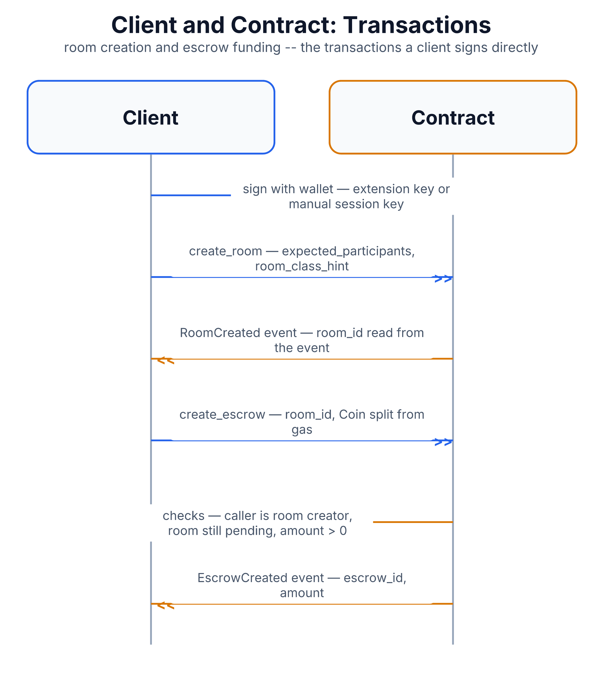

# Client and Contract: Transactions

While [`client-chain-discovery.md`](client-chain-discovery.md) covers the
client *asking* the contract questions for free, this file covers the
client *doing* things on-chain — actions that cost a small transaction fee,
require a wallet signature, and permanently change contract state.

## Why this protocol exists

A handful of actions can only originate from the person actually using the
app: registering as a known user, creating a room, closing it, and putting
up payment for a call. Nothing else in the system (no worker, no
control-plane daemon) can do these on the client's behalf, because they
all require the client's own signature as proof of consent.

## Message flow

1. **Register user** — the first time someone uses the app, the client
   submits a transaction registering their wallet address with a display
   name in the contract's user registry. If they're already registered,
   the contract's "already registered" response is treated as a success
   rather than an error — registering twice isn't a mistake worth
   surfacing to the user.
2. **Create room** — the client submits a transaction asking the contract
   to create a new room (with an expected participant count and a size
   hint). The contract responds with a `RoomCreated` event, and the
   client reads the new room's ID directly out of that event — there's no
   separate "look up my new room" step.
3. **Close room** — a direct transaction ending a room the client created.
4. **Create escrow** (fund the call) — the client locks payment into a
   dedicated on-chain escrow tied to the room, splitting the coin straight
   out of their own gas balance. The contract enforces three things before
   accepting this: the caller must be the room's original creator, the
   room must still be in its initial "pending" state (not already active
   or closed), and the amount must be greater than zero. This escrow is
   what eventually pays relays for their work — see
   [`rewards-and-escrow.md`](rewards-and-escrow.md) for what happens to it
   after the call.
5. **Local faucet request** (development only) — on a local test network,
   the client can ask a local faucet service for free test funds. This is
   a plain HTTP call, not a contract interaction, and it's a no-op on any
   real network — purely a developer convenience.

## Wallet and authentication model

There is no login step, no session token, and no on-chain "you are now
authenticated" object. **Identity is entirely defined by whichever wallet
signed a given transaction.** Every one of the actions above is checked by
the contract purely by looking at the transaction's signer — "is the
signer the room's creator," for example, in the escrow check above. There
is nothing to steal except the private key itself; there's no session to
hijack separately from that.

The client supports two ways of producing that signature:

- **Browser extension wallet** (the normal path) — the extension holds the
  private key, and the client asks it to sign each transaction. The key
  never touches the client's own code.
- **Manual wallet** (a development/testnet fallback) — the user pastes a
  raw private key directly into the app, which is parsed into a usable
  keypair and kept only in the browser tab's session storage (cleared
  automatically when the tab closes). This exists specifically to work
  around a wallet-extension bug encountered during development, and is
  explicitly documented in the code as unsuitable for production use.

Both paths converge on the same transaction executor before anything is
submitted — the rest of the client code doesn't need to know or care which
signing method is in use.

## Diagram

Diagram built from React source in [`docs/imgen/src/diagrams/proto-client-chain-transactions.tsx`](../imgen/src/diagrams/proto-client-chain-transactions.tsx) — run `pnpm build` in `docs/imgen/` to regenerate.

## Call reference

| Action | What it does | Key on-chain checks |
|---|---|---|
| Register user | Adds the wallet to the user registry | "already registered" is treated as success |
| Create room | Creates a new room, emits `RoomCreated` | — |
| Close room | Ends a room the caller created | — |
| Create escrow | Locks payment for the room | caller is room creator; room still pending; amount &gt; 0 |
| Faucet request (dev only) | Requests local test funds | not a contract call; no-op outside local dev networks |

## Security notes

- **Every check is a signer check, not a password check.** There is
  nothing equivalent to a session cookie to leak — only the private key
  itself is sensitive.
- **The manual wallet path is a deliberate, documented exception**, not a
  hidden shortcut — it trades real security for developer convenience and
  is scoped to session storage so it doesn't persist past the browser tab.
- **Escrow funding double-checks the room's state before accepting funds**
  (must still be pending), preventing a client from funding a room that's
  already active or already closed.
