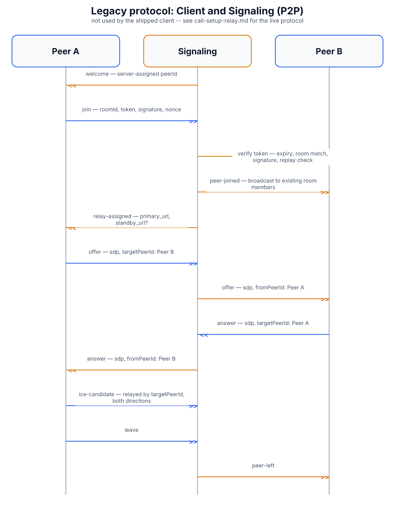

# Legacy Protocol: Client and Signaling (P2P)

> **This protocol is not used by the shipped client.** The `apps/signaling`
> worker still implements it fully — join, offer/answer/ICE relay,
> cap-token auth — but no code in the current browser client opens a
> WebSocket to it or speaks it. The live client instead talks directly to
> the relay's own signaling channel, documented in
> [`call-setup-relay.md`](call-setup-relay.md). This file exists so the
> design is still discoverable — for anyone extending the system back
> towards a peer-to-peer model, or just trying to understand why a
> `signaling` worker with a full admission protocol exists alongside a
> relay that also does its own signaling.

## Why this protocol was built

Before the relay took over media negotiation directly, the plan was a more
traditional WebRTC setup: two peers exchange connection offers through a
neutral third party (the **signaling** worker), then talk to each other
directly, peer-to-peer, with the signaling server stepping out of the way
once the handshake is done. This file documents that original design.

## Message flow

1. **`welcome`** — as soon as a client opens a WebSocket to the signaling
   worker, the server immediately assigns and sends back a `peerId` — the
   client doesn't get to pick its own id here (unlike the relay protocol).
2. **`join`** — the client sends `roomId`, plus (once authentication is
   wired in) three proof-of-authorization fields: `token` (the on-chain id
   of a `RoomCapability` — see [`cap-token.md`](cap-token.md)),
   `signature` (an `ed25519` signature proving the client holds the key
   the token was issued to), and `nonce` (a strictly-increasing counter
   that stops an old, captured `join` message from being replayed later).
3. **Admission checks** — when auth is enabled, the server rejects the
   join for any of these reasons, each closing the connection with a
   specific code the client can use to know what went wrong:
   - no token supplied, or the token isn't known (close `4401`)
   - the token has been revoked (close `4403`)
   - the token has expired (close `4401`)
   - the token was issued for a different room (close `4401`)
   - the signature doesn't verify against the token's on-file public key
     (close `4401`) — note it always checks against the key the token was
     *issued to*, never a key the client claims in the message itself,
     so a stolen token can't be re-signed by an attacker's own key
   - the nonce isn't strictly greater than the last one seen for this
     token (close `4401`) — blocks replay of an old join
   - this peer's public key already has a live connection elsewhere
     (close `4409`) — first connection wins, the new one is refused
4. **`peer-joined`** — once admitted, the server adds the peer to the room
   and broadcasts this notification to everyone already in it.
5. **`relay-assigned`** — if the room has relay(s) already assigned
   on-chain, the server immediately pushes their URLs (a `primary_url` and
   an optional `standby_url`) down to the newly-joined peer.
6. **`offer`** / **`answer`** / **`ice-candidate`** — the actual WebRTC
   handshake, relayed verbatim between two peers who both know each
   other's `peerId` (learned from `peer-joined`). Each message names a
   `targetPeerId`; the server forwards it to that specific peer only,
   relabeling it with `fromPeerId` so the recipient knows who sent it.
   ICE candidate contents are deliberately never logged server-side, since
   they can contain private local IP addresses.
7. **`leave`** — sent explicitly, or implied by closing the WebSocket.
   Either way the server removes the peer from its room and broadcasts
   `peer-left` to the rest of the room. When a room's last peer leaves,
   the room is torn down and the completed session is counted for reward
   accounting.

## Diagram

Diagram built from React source in [`docs/imgen/src/diagrams/proto-legacy-p2p-signaling.tsx`](../imgen/src/diagrams/proto-legacy-p2p-signaling.tsx) — run `pnpm build` in `docs/imgen/` to regenerate.

## Message reference

| Direction | Message | Carries |
|---|---|---|
| Signaling → Client | `welcome` | `peerId` (server-assigned) |
| Client → Signaling | `join` | `roomId`, `token?`, `signature?`, `nonce?` |
| Signaling → Client | `peer-joined` / `peer-left` | `peerId`, `roomId` |
| Signaling → Client | `relay-assigned` | `room_id`, `primary_url`, `standby_url?` |
| Client → Signaling | `offer` / `answer` | `sdp`, `targetPeerId` |
| Signaling → Client | `offer` / `answer` | `sdp`, `fromPeerId` |
| Client → Signaling | `ice-candidate` | `candidate`, `targetPeerId` |
| Signaling → Client | `ice-candidate` | `candidate`, `fromPeerId` |
| Client → Signaling | `leave` | — |

## Security notes

- **Rate limiting**: at most 10 concurrent connections per IP address, and
  at most 100 messages per second per connection — both enforced by
  closing the offending connection (`4029`) rather than silently dropping
  messages.
- **Message size cap**: 64 KB per WebSocket frame.
- **One live connection per public key**: prevents the same authorized
  identity from being used to open multiple simultaneous sessions.
- **Signature verification always uses the token's on-file key**, never a
  key asserted in the message — this is what stops a captured token from
  being replayed by a different signer.
- Since this protocol isn't in the client's live path, its cap-token
  admission logic is otherwise identical in spirit to nothing else in the
  shipped system — the relay's own protocol
  ([`call-setup-relay.md`](call-setup-relay.md)) uses a much simpler
  room-password admission model instead.
