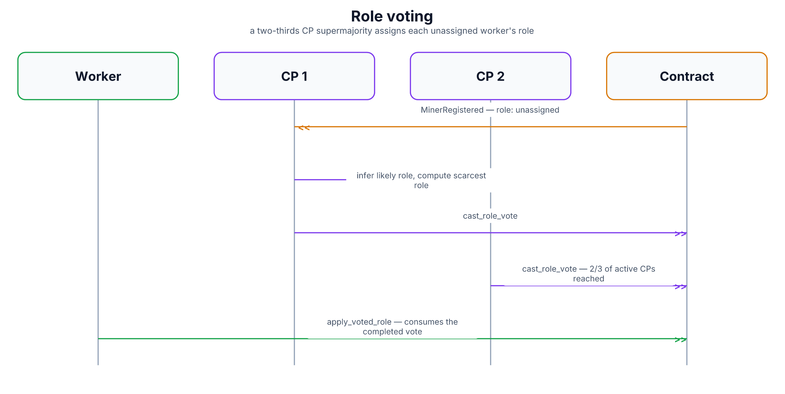

# Role Voting

A newly-registered worker doesn't get to pick its own job. This document
covers how a worker that's staked but not yet assigned a role (see
[`worker-registration.md`](worker-registration.md)) actually becomes a
relay, a signaling node, or a validator — decided by a vote among the
control-plane (CP) daemons, not by the worker itself and not by any single
CP acting alone.

## Why a vote, and why a supermajority

Letting a worker declare its own role would make it trivial to flood the
network with, say, fake relays. Letting one CP operator unilaterally assign
roles would just move that same single-point-of-trust problem somewhere
else. A two-thirds supermajority of active CPs voting on each assignment
means no small minority of control-plane operators can steer who ends up
running what.

## Message flow

1. CP daemons watch for newly-registered, still-unassigned workers (role =
   "user") — both reactively, from registration events, and periodically,
   by re-scanning the chain for anyone that slipped through.
2. For each one, a CP daemon makes an educated guess at what role the
   worker was probably built to run, based on hints already present in its
   on-chain profile (declared bandwidth suggests relay; CPU cores with no
   bandwidth suggests signaling; neither suggests validator) — this isn't
   binding, just a starting signal.
3. The CP daemon separately computes which role the network is currently
   **shortest on**, by comparing each registry's active count, and casts
   its vote for that role via `role_voting::cast_role_vote` — prioritizing
   network need over the worker's guessed intent when they conflict.
4. Once **two thirds of currently-active CPs** have cast the same vote for
   a given worker, the assignment reaches quorum.
5. The worker itself — not any CP — submits the final step: it consumes
   the completed vote and applies the role
   (`registration::apply_voted_role`, see
   [`worker-registration.md`](worker-registration.md) for what that
   actually updates). This is what unblocks the second half of
   registration — enrolling in the role-specific registry.

## Re-voting

A worker that's already assigned a role can still become eligible for
re-assignment later (for instance, if network conditions shift enough that
a different role would be more useful). When the chain marks a worker as
re-vote-eligible, the same CP voting machinery kicks in again for it,
computing a fresh best-fit role and voting it through the same
supermajority process.

## Diagram

Diagram built from React source in [`docs/imgen/src/diagrams/proto-role-voting.tsx`](../imgen/src/diagrams/proto-role-voting.tsx) — run `pnpm build` in `docs/imgen/` to regenerate.

## Security notes

- **Quorum is two thirds of currently-active CPs**, not a fixed number —
  it scales with how many CPs are actually online at the time.
- **The worker applies its own role, but only after quorum is already
  reached on-chain** — it can't skip ahead or apply a role that wasn't
  actually voted through.
- **Role selection favors network need over a worker's declared
  intent**, which keeps the CP voting process from being trivially steered
  by workers just claiming whatever role they'd prefer.
