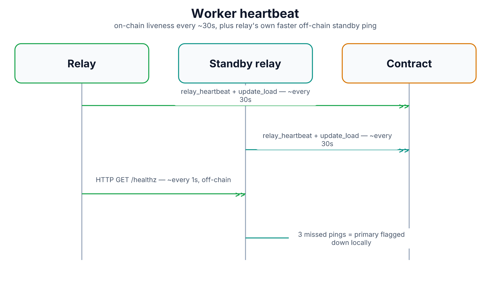

# Worker Heartbeat

Once a worker is registered (see [`worker-registration.md`](worker-registration.md)),
the rest of the system needs an ongoing way to know it's still alive —
without anyone having to actively go ask it. That's what a heartbeat is: a
worker periodically telling the chain "I'm still here," so anyone watching
the chain can tell when one stops.

## Message flow

Every worker daemon type submits its own heartbeat call to its own
registry, roughly every 30 seconds by default:

- **Control plane** calls `control_plane_registry::heartbeat` — liveness
  only, no extra data.
- **Relay** combines `relay_registry::relay_heartbeat` with
  `relay_registry::update_load` in the same transaction, reporting its
  current load (room count plus active session count) alongside the
  liveness signal, so the system can also see which relays are getting
  busy, not just which ones are alive.
- **Signaling** does the same combined pattern, reporting its active
  WebSocket connection count as load.
- **Validator** calls `validator_registry::heartbeat` — liveness only, and
  notably **must be signed by the validator's main wallet**, not a
  disposable per-session wallet. This matters because a validator's main
  identity is what's staked and slashable; a session wallet (used for
  covert auditing, see [`canary-audit.md`](canary-audit.md)) deliberately
  can't stand in for it here.

Anyone watching — most importantly cp-daemon's failover logic in
[`room-lifecycle.md`](room-lifecycle.md) — reads how long it's been since a
worker's last heartbeat to decide whether it's still considered live.

## A separate, faster, off-chain signal

Relay also runs its own lightweight, **off-chain** heartbeat between a
primary and its standby: a plain HTTP ping roughly once a second. This has
nothing to do with the chain — it exists purely so a standby relay can
notice its primary is unreachable fast enough to act on it locally (see
[`relay-failover.md`](relay-failover.md)), well before the ~30-second
on-chain heartbeat interval and cp-daemon's sweep would catch up. Missing
three consecutive pings is enough to flag the primary as down from the
standby's point of view.

## Diagram

Diagram built from React source in [`docs/imgen/src/diagrams/proto-worker-heartbeat.tsx`](../imgen/src/diagrams/proto-worker-heartbeat.tsx) — run `pnpm build` in `docs/imgen/` to regenerate.

## Reference

| Daemon | Call | Extra data | Interval |
|---|---|---|---|
| cp-daemon | `control_plane_registry::heartbeat` | — | ~30s |
| Relay | `relay_registry::relay_heartbeat` + `update_load` | room count, active sessions | ~30s |
| Signaling | `signaling_registry::heartbeat` + `update_load` | active connection count | ~30s |
| Validator | `validator_registry::heartbeat` | — | ~30s, main wallet only |
| Relay (standby link) | plain `HTTP GET /healthz` | — | ~1s, off-chain |

## Security notes

- **A validator's heartbeat can't be signed by a session wallet** — this
  keeps the "is this validator alive" signal tied to the one identity
  that's actually staked, separate from the disposable identities used for
  covert auditing.
- **The off-chain standby ping is purely a speed optimization, not a trust
  boundary** — it has no bearing on-chain, so there's nothing to game by
  spoofing it; the actual failover decision still runs through the
  on-chain heartbeat watch in [`room-lifecycle.md`](room-lifecycle.md).
