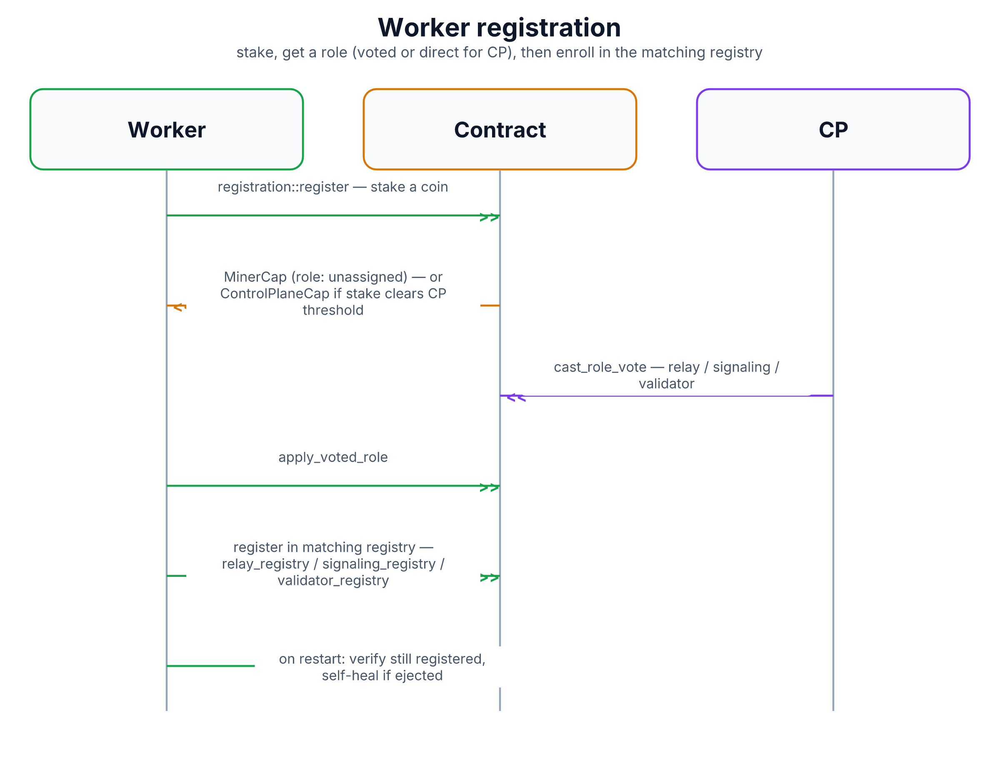

# Worker Registration

Every worker daemon — signaling, relay, control-plane (cp-daemon), and
validator — has to register on-chain before it's allowed to do its job.
This document covers that two-step process, shared by all four daemon
types with only the stake amounts and registry differing.

## Why staking first

Registration isn't free: an operator has to lock up a stake before their
worker is trusted with any traffic. This is what gives the slashing
mechanism (see [`health-and-slashing.md`](health-and-slashing.md)) teeth —
there's something real to lose if a worker misbehaves.

## Message flow

1. **Stake and get a capability.** The daemon submits a registration
   transaction that splits off a coin as its stake. What it gets back
   depends on the stake amount: if it clears a (dynamically rising)
   threshold, it's granted a `ControlPlaneCap` — becoming a CP directly,
   no vote needed, since CPs are the ones who vote other workers into
   roles, and there'd be nobody to vote for the very first CPs. Below that
   threshold, it gets a plain `MinerCap` with an unassigned role, pending a
   vote (see [`role-voting.md`](role-voting.md)). Either way, this step
   also creates a `StakePosition` object holding the locked coin.
2. **Wait for a role, if not a CP.** A non-CP daemon polls the chain for a
   role assignment. Once a CP daemon votes it into relay, signaling, or
   validator (again, [`role-voting.md`](role-voting.md)), the daemon itself
   submits a follow-up transaction that consumes the vote and formally
   applies the new role — atomically updating its capability, its profile,
   and its stake position to agree on the same role.
3. **Enroll in the matching registry.** Now holding a role-specific
   capability, the daemon enrolls itself in the registry other parties
   actually query to find it: relays register in the relay registry with a
   0.25 SUI stake, signaling nodes in the signaling registry with a 0.05
   SUI stake, validators in the validator registry with a 0.1 SUI stake,
   and CPs in the control-plane registry (CPs skip the voting step and
   register directly, since step 1 already granted them their capability).
   This is the step that makes a worker actually discoverable — see
   [`client-chain-discovery.md`](client-chain-discovery.md) for how clients
   read these same registries.

## Staying registered across restarts

Every daemon checks, on every boot, whether its previously-known capability
id is still a live member of its registry. If it was ejected (for instance
by the liveness-ejection path in
[`health-and-slashing.md`](health-and-slashing.md), which force-returns the
stake), it re-registers from scratch rather than trying to resurrect a dead
identity. If a previous registration attempt was interrupted partway
through, it tries to recover the partially-created objects (capability,
stake position) before giving up and starting over. Relay and signaling
daemons also refresh their advertised endpoint URL on every boot regardless
of registration state, since redeployments often change a worker's public
address.

## Diagram

Diagram built from React source in [`docs/imgen/src/diagrams/proto-worker-registration.tsx`](../imgen/src/diagrams/proto-worker-registration.tsx) — run `pnpm build` in `docs/imgen/` to regenerate.

## Reference

| Role | Registry stake | Role source |
|---|---|---|
| Control plane (CP) | dynamic threshold, rising with CP count | direct, at registration |
| Relay | 0.25 SUI | role vote |
| Signaling | 0.05 SUI | role vote |
| Validator | 0.1 SUI | role vote (voting mode required — never auto-assigned) |

## Security notes

- **A worker can't just declare its own role** — every non-CP role comes
  from a CP quorum vote, not a self-selected flag.
- **Stake is what makes ejection and slashing meaningful** — see
  [`health-and-slashing.md`](health-and-slashing.md) for what happens to a
  stake when a worker goes dark or misbehaves.
- **Transitioning between CP and non-CP roles is deliberately blocked** —
  it requires unregistering and registering fresh rather than a direct
  re-vote, since CP status is granted a fundamentally different way (stake
  threshold, not a vote) than every other role.
