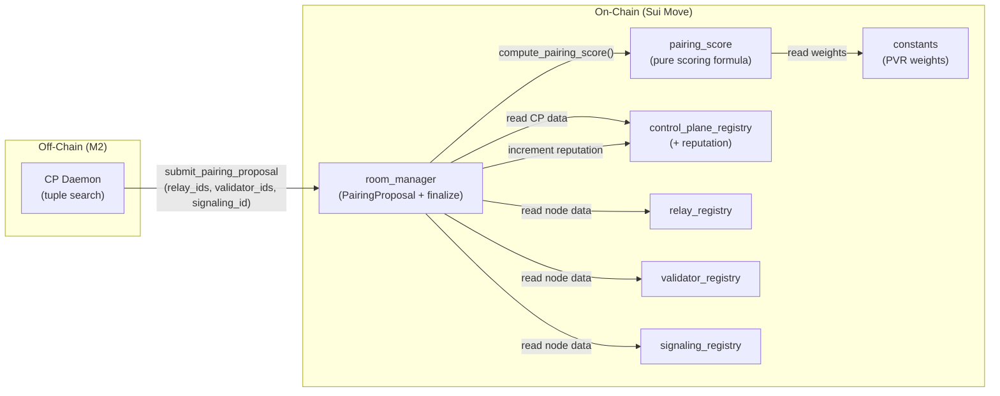
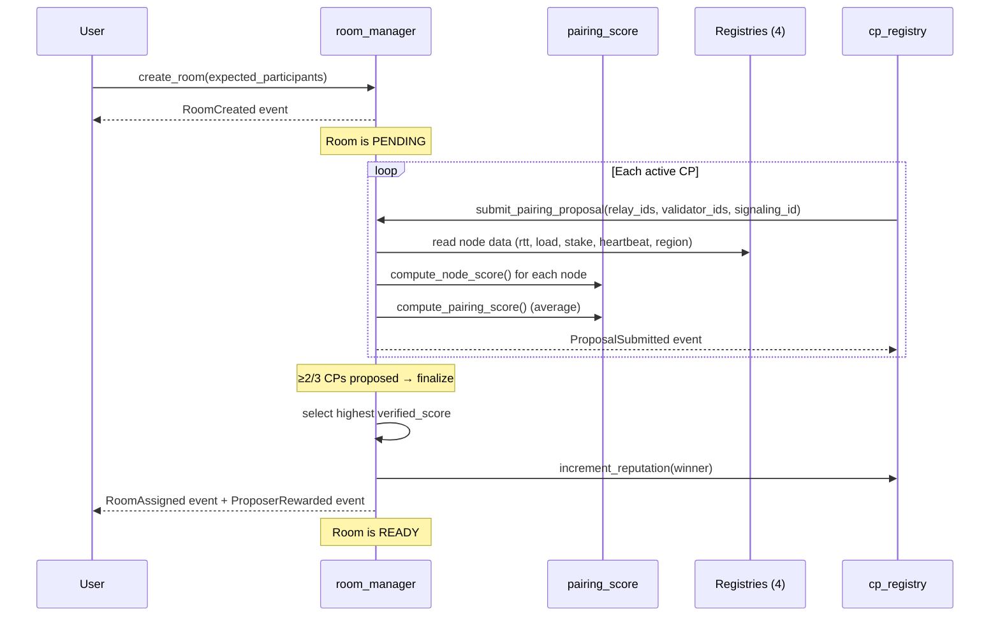

# Milestone 1 — Design: On-chain PVR Contract

## Metadata
```yaml
quangflow_version: "1.1.0"
chosen_option: C (Contract-Computed)
milestone: 1
created: 2026-03-17
```

## Architecture Overview


## Chosen Option: C — Contract-Computed Scoring

### Rationale
- **No timing problem**: Score computed at submission time from current on-chain state — no stale-data mismatch between CP and contract
- **Simplest implementation**: No tolerance bands, no epoch guards, no snapshot verification
- **CPs still compete**: Value-add is the combinatorial search (finding the best tuple), not the arithmetic
- **M2 trivial**: Daemon submits tuples only — no formula replication needed, zero risk of score mismatch
- **Deterministic and verifiable**: Anyone can re-derive the score from on-chain state at the submission epoch

### Rejected Options

**Option A (Snapshot-Verified)**: CP submits score + snapshot of input values. Contract verifies snapshot matches on-chain state. Problem: state changes between CP computation and TX execution cause valid proposals to fail. Tolerance bands add complexity. Ultimately redundant — if contract re-derives the score anyway, CP's score is unnecessary.

**Option B (Epoch Guard)**: All proposals locked to one epoch for state consistency. Problem: Sui epochs are ~24h — rooms created late in an epoch have insufficient proposal time. Forces all CPs to be available simultaneously.

## Tension Resolutions

| Tension | Resolution |
|---------|-----------|
| Verification cost vs trust | Contract computes score — no trust needed, cost accepted for thesis |
| New module vs extending room_manager | New `pairing_score.move` in `sources/scoring/` — pure math, no state |
| State timing | Eliminated — contract reads state at TX execution time |
| Proportional validators | Formula in constants: `max(MIN_VALIDATORS, expected_participants / VALIDATOR_RATIO)` |

## Module Changes

### NEW: `sources/scoring/pairing_score.move`

Pure scoring module. No shared objects. No state mutations. Only math.

```
module dvconf::pairing_score {
    /// Compute score for a single node.
    /// All inputs are raw on-chain values. Returns 0-10000 (basis points).
    public fun compute_node_score(
        rtt: u64,              // validator_probed_rtt (ms)
        load: u64,             // current_load (connections)
        stake: u64,            // stake_amount (MIST)
        heartbeat_age: u64,    // current_epoch - last_heartbeat
        region_match: bool,    // does node region match room region?
        history_score: u64,    // avg quality multiplier from past sessions (0-10000)
    ): u64

    /// Compute aggregate pairing score = average of all node scores.
    public fun compute_pairing_score(
        node_scores: &vector<u64>,
    ): u64

    /// Compute required validator count from expected_participants.
    public fun required_validators(
        expected_participants: u64,
    ): u64
}
```

**Formula per node:**
```
score = (rtt_score * W_RTT + load_score * W_LOAD + stake_score * W_STAKE
       + liveness_score * W_LIVENESS + region_score * W_REGION
       + history_score * W_HISTORY) / BASIS_POINTS

Where:
  rtt_score      = (MAX_RTT - min(rtt, MAX_RTT)) * BASIS / MAX_RTT
  load_score     = (MAX_LOAD - min(load, MAX_LOAD)) * BASIS / MAX_LOAD
  stake_score    = min(stake, STAKE_CAP) * BASIS / STAKE_CAP
  liveness_score = heartbeat_age < FRESH: 10000, < STALE: 5000, else: 0
  region_score   = match: 10000, else: 0
  history_score  = raw value (already 0-10000), default 5000 for new nodes
```

**Validator scaling:**
```
required = max(MIN_VALIDATORS_PER_ROOM, expected_participants / VALIDATOR_RATIO)
capped at MAX_VALIDATORS_PER_ROOM
```

### MODIFIED: `sources/core/constants.move`

New constants (all with accessors):

```
// ── PVR Scoring Weights (basis points, sum = 10_000) ──
PVR_W_RTT: u64          = 3_000
PVR_W_LOAD: u64         = 2_500
PVR_W_STAKE: u64        = 1_500
PVR_W_LIVENESS: u64     = 1_000
PVR_W_REGION: u64       = 1_000
PVR_W_HISTORY: u64      = 1_000

// ── PVR Scoring Thresholds ──
PVR_MAX_RTT: u64             = 500     // ms — above this, RTT score = 0
PVR_MAX_LOAD: u64            = 100     // connections — above this, load score = 0
PVR_STAKE_CAP: u64           = 5_000_000_000  // 5 SUI — diminishing returns above
PVR_HEARTBEAT_FRESH: u64     = 3       // epochs — full liveness score
PVR_HEARTBEAT_STALE: u64     = 7       // epochs — half liveness score
PVR_DEFAULT_HISTORY: u64     = 5_000   // default for nodes with no session history

// ── Validator Scaling ──
PVR_VALIDATOR_RATIO: u64         = 3       // 1 validator per N participants
PVR_MAX_VALIDATORS_PER_ROOM: u64 = 5      // hard cap

// ── Proposer Reward ──
PVR_PROPOSER_REWARD: u64 = 100     // flat reward units per winning proposal
```

### MODIFIED: `sources/registry/room_manager.move`

**Struct changes:**
```
// RoomInfo — add field:
expected_participants: u64,
assigned_validators:   vector<ID>,

// Replace RelayBallot with:
public struct PairingProposal has store, copy, drop {
    cp_id:         ID,
    relay_ids:     vector<ID>,
    validator_ids: vector<ID>,
    signaling_id:  ID,
    verified_score: u64,    // computed by contract at submission time
}

// Replace room_votes with:
room_proposals: Table<ID, vector<PairingProposal>>,
```

**Function changes:**
```
// create_room — add expected_participants parameter
public fun create_room(
    ...,
    expected_participants: u64,  // NEW
    ...
)

// Replace submit_relay_vote with:
public fun submit_pairing_proposal(
    net_reg: &NetworkRegistry,
    manager: &mut RoomManager,
    cp_reg: &mut ControlPlaneRegistry,   // mut for reputation update
    relay_reg: &RelayRegistry,           // NEW — for score computation
    validator_reg: &ValidatorRegistry,   // NEW — for score computation
    signaling_reg: &SignalingRegistry,   // NEW — for score computation
    cap: &ControlPlaneCap,
    room_id: ID,
    relay_ids: vector<ID>,
    validator_ids: vector<ID>,           // NEW
    signaling_id: ID,
)

// Flow inside submit_pairing_proposal:
// 1. Paused check, PENDING guard, CP registered check
// 2. Validate ballot size: relay_ids >= min_relays, validator_ids >= required_validators(expected_participants)
// 3. Liveness check: all proposed nodes must have active heartbeat
// 4. Compute score: for each node, read data from registry, call pairing_score::compute_node_score()
// 5. Average all node scores via pairing_score::compute_pairing_score()
// 6. Store PairingProposal with verified_score
// 7. Check threshold: if proposals >= 2/3 active CPs → finalize
// 8. Finalize: pick highest verified_score, assign to room, PENDING→READY
// 9. Increment winning CP's reputation
// 10. Emit ProposalSubmitted event, then RoomAssigned event on finalize
```

**New events:**
```
public struct ProposalSubmitted has copy, drop {
    room_id:        ID,
    cp_id:          ID,
    verified_score: u64,
    relay_count:    u64,
    validator_count: u64,
}

public struct ProposerRewarded has copy, drop {
    room_id: ID,
    cp_id:   ID,
    reward:  u64,
}
```

**Kept as-is:**
- `assign_relay_and_signaling()` — single-CP/dev fallback (PVR-11)
- `close_room()` — cleans up `room_proposals` instead of `room_votes`
- All read accessors

### MODIFIED: `sources/registry/control_plane_registry.move`

**Struct changes:**
```
// CPNodeInfo — add field:
reputation: u64,   // wins counter, starts at 0
```

**New functions:**
```
// Package-only: increment reputation (called by room_manager on proposal win)
public(package) fun increment_reputation(
    registry: &mut ControlPlaneRegistry,
    miner_id: ID,
)

// Read accessor
public fun info_reputation(i: &CPNodeInfo): u64
```

### NOT MODIFIED
- `relay_registry.move` — read-only access, no structural changes
- `validator_registry.move` — read-only access, no structural changes
- `signaling_registry.move` — read-only access, no structural changes
- `economic_layer.move` — reward distribution unchanged
- `staking.move`, `caps.move`, `miner_store.move` — unchanged

## Error Code Allocation

| Code | Constant | Module | Description |
|------|----------|--------|-------------|
| 507 | E_DUPLICATE_PROPOSAL | room_manager | CP already proposed for this room |
| 508 | E_NOT_PENDING | room_manager | Room not in PENDING status (reuse) |
| 509 | E_INVALID_PROPOSAL | room_manager | Ballot size too small (reuse) |
| 700 | E_NODE_NOT_ACTIVE | pairing_score | Proposed node failed liveness check |
| 701 | E_INVALID_VALIDATOR_COUNT | room_manager | validator_ids count < required |

Note: 507-509 reused from old voting system (same semantics). 700+ for new scoring module.

## Data Flow: Room Assignment Lifecycle



## Scalability Assessment

| Dimension | Assessment |
|-----------|-----------|
| 10x nodes (500 relays) | No contract impact — CPs do the search. Contract scores 1 tuple per proposal. |
| 100x nodes (5000 relays) | CPs need smarter search algorithms. Contract unchanged. |
| Team parallel work | `pairing_score.move` has zero dependencies on registries — fully parallelizable. `constants.move` changes are additive. `room_manager.move` changes are localized to proposal functions. |
| M2 compatibility | **Excellent** — daemon only submits tuples, no formula replication. |

## Cross-Milestone Notes

- M2 (off-chain + client) depends on M1's `submit_pairing_proposal` signature being stable
- `ProposalSubmitted` event schema determines what the CP daemon watches for
- `expected_participants` field on `create_room` changes the client's room creation flow (M2)
- The `PVR_PROPOSER_REWARD` mechanism (how reward is funded) is deferred to M2 integration with `economic_layer` — M1 just emits the event and increments reputation

## Test Plan (M1)

| # | Test Case | Covers |
|---|-----------|--------|
| 1 | `compute_node_score` with known inputs → expected output | PVR-02 |
| 2 | `compute_node_score` edge cases (max RTT, zero stake, stale heartbeat) | PVR-02 |
| 3 | `compute_pairing_score` averages correctly | PVR-02 |
| 4 | `required_validators` scaling and capping | PVR-07 |
| 5 | `create_room` stores `expected_participants` | PVR-01 |
| 6 | `submit_pairing_proposal` rejects inactive nodes | PVR-04 |
| 7 | `submit_pairing_proposal` computes and stores verified_score | PVR-05 |
| 8 | Duplicate proposal from same CP rejected | PVR-05 |
| 9 | Finalization after ≥2/3 CPs propose — highest score wins | PVR-06 |
| 10 | Tie-breaking: equal scores → higher reputation wins | PVR-10 |
| 11 | Winner reputation incremented | PVR-09 |
| 12 | ProposerRewarded event emitted | PVR-08 |
| 13 | Fallback `assign_relay_and_signaling` still works | PVR-11 |
| 14 | All 153 existing tests still pass | PVR-12 |
