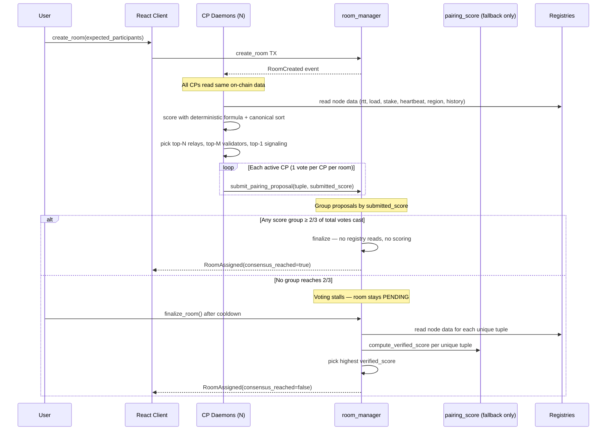

# Milestone 2 — Design: Consensus-First, Verify-on-Dispute

## Metadata
```yaml
quangflow_version: "1.1.0"
chosen_option: "Consensus-First, Verify-on-Dispute"
milestone: 2
created: 2026-03-26
depends_on: M1 (PVR on-chain contract)
```

## Core Philosophy

**Minimize on-chain work.** The contract is a consensus counter in the happy path and a scoring judge only when CPs disagree. Reputation + quantity = security. The more CPs participate, the stronger the consensus guarantee.

## Architecture Overview



## Consensus Model: Two-Path Resolution

### Happy Path (expected 99% of cases)

Zero on-chain computation. Contract is a vote counter.

1. `RoomCreated` event fires with `expected_participants`
2. Each active CP independently:
   a. Reads all eligible node data from on-chain registries (via RPC, not TX)
   b. Scores each node using the **deterministic 6-factor formula** (same as `pairing_score.move`)
   c. Applies **canonical sort**: score descending, tie-break by node ID (lexicographic)
   d. Selects top-N relays, top-M validators, top-1 signaling
   e. Computes `pairing_score` = average of all node scores
   f. Submits `(tuple, submitted_score)` on-chain via `submit_pairing_proposal()`
3. Each CP can only vote **once per room** (enforced by `E_DUPLICATE_PROPOSAL`)
4. Contract groups proposals by `submitted_score` equality
   - Deterministic formula + canonical sort = same score implies same tuple
   - No `tuple_hash` needed — `u64` comparison is cheap
5. If any score group reaches **≥ 2/3 of total votes cast** → immediate finalization
6. First submitter in the winning group gets reputation increment
7. Room transitions PENDING → READY

### Dispute Path (fallback)

On-chain computation as arbiter. Expensive but guarantees resolution.

8. If no score group reaches 2/3, room stays PENDING
9. After `PVR_DISPUTE_COOLDOWN` epochs, the **room creator** can call `finalize_room()`
   - Gated: `room.creator == ctx.sender()` — prevents spam, natural motivation
   - Requires at least 2 proposals exist
10. Contract reads registries and calls `pairing_score::compute_node_score()` + `compute_pairing_score()` for each unique tuple
11. Highest `verified_score` wins
12. Room finalized. **No reputation bump** (CPs disagreed — no clear winner)

### Why This Works

- **Deterministic formula + canonical sort** = all honest CPs produce the same tuple
- Disagreement means: stale data, buggy daemon, or network partition — all rare
- **Reputation incentivizes CPs** to stay synced and correct
- `pairing_score.move` is kept as the **judge**, not the **workhorse**
- As CP count grows, collusion becomes harder; reputation makes CPs self-policing
- **Vote count threshold** (not active CP count) — no dependency on `active_cp_count()`
- Offline CPs simply don't vote, don't affect denominator

### Consensus Threshold

- Threshold: ≥ 2/3 (6,667 bps) of **total votes cast for this room**
- Denominator: number of proposals submitted (not active CP count)
- Each CP votes at most once per room (`E_DUPLICATE_PROPOSAL`)
- Stored as `PVR_CONSENSUS_THRESHOLD_BPS = 6_667` in `constants.move`

Example: 6 CPs vote. 4 submit score 8500, 2 submit score 8200.
- Group 8500: 4/6 = 66.7% ≥ 66.7% → finalize on group 8500

Example: 3 CPs vote. 2 submit score 8500, 1 submits score 8200.
- Group 8500: 2/3 = 66.7% ≥ 66.7% → finalize on group 8500

## Canonical Sort Specification

All CPs must sort identically to reach consensus. The sort is:

```
For each node type (relay, validator, signaling):
  1. Score each eligible node using compute_node_score()
  2. Sort descending by score
  3. Tie-break: ascending by node ID (bytes lexicographic)
  4. Select top-N from sorted list

N values:
  - Relays: min_relays_per_room (from RoomRules, currently 2)
  - Validators: required_validators(expected_participants) from pairing_score formula
  - Signaling: 1 (always exactly one)
```

**Eligibility filter** (applied before scoring):
- Node must be registered and active (not unregistered)
- Node heartbeat age < `PVR_HEARTBEAT_STALE` epochs (7)
- Node must support the room's relay_mode (SFU or MCU) — for relays only

## Scoring Formula (Daemon Must Match Exactly)

This is the source of truth. Both `scoring.ts` and `pairing_score.move` must implement this identically. Consensus depends on all CPs producing the same score for the same inputs.

### Per-Node Score (0-10,000 basis points)

```
rtt_score      = (MAX_RTT - min(rtt, MAX_RTT)) * 10000 / MAX_RTT
load_score     = (MAX_LOAD - min(load, MAX_LOAD)) * 10000 / MAX_LOAD
stake_score    = min(stake, STAKE_CAP) * 10000 / STAKE_CAP
liveness_score = heartbeat_age < FRESH(3): 10000, < STALE(7): 5000, else: 0
region_score   = region_match ? 10000 : 0
history_score  = raw value (0-10000), default 5000 for new nodes

node_score = (rtt_score * 3000 + load_score * 2500 + stake_score * 1500
            + liveness_score * 1000 + region_score * 1000
            + history_score * 1000) / 10000
```

### Constants (from `constants.move`)

| Constant | Value | Unit |
|----------|-------|------|
| PVR_W_RTT | 3,000 | bps |
| PVR_W_LOAD | 2,500 | bps |
| PVR_W_STAKE | 1,500 | bps |
| PVR_W_LIVENESS | 1,000 | bps |
| PVR_W_REGION | 1,000 | bps |
| PVR_W_HISTORY | 1,000 | bps |
| PVR_MAX_RTT | 500 | ms |
| PVR_MAX_LOAD | 100 | connections |
| PVR_STAKE_CAP | 5,000,000,000 | MIST (5 SUI) |
| PVR_HEARTBEAT_FRESH | 3 | epochs |
| PVR_HEARTBEAT_STALE | 7 | epochs |
| PVR_DEFAULT_HISTORY | 5,000 | bps |

### Pairing Score

```
pairing_score = sum(all_node_scores) / count(all_nodes)
```

Where `all_nodes` = selected relays + selected validators + selected signaling.

## Contract Changes

### `room_manager.move` — Refactor `submit_pairing_proposal()`

**Current:** Every proposal triggers full on-chain score computation via `pairing_score::compute_node_score()`.

**New:** Consensus-first. Store CP-submitted score, count matching votes, fallback only on dispute.

```
submit_pairing_proposal(
    net_reg, manager, cp_reg,
    relay_reg, validator_reg, signaling_reg,  // passed through but NOT read in happy path
    cap, room_id,
    relay_ids, validator_ids, signaling_id,
    submitted_score: u64,                     // NEW: CP-computed score
)

Flow:
  1. Paused check, PENDING guard, CP registered, no duplicate
  2. Validate ballot size (relay count >= min, validator count >= required)
  3. Liveness check: all proposed nodes must have active heartbeat (cheap read)
  4. Store PairingProposal { cp_id, relay_ids, validator_ids, signaling_id, submitted_score }
  5. Emit ProposalSubmitted event (already includes verified_score field — repurposed as submitted_score)
  6. Count total votes for this room
  7. Count votes matching this submitted_score
  8. If matching_votes * 10000 / total_votes >= 6667 → finalize via consensus path
     - Assign room with this proposal's tuple
     - Store submitted_score as verified_score in RoomInfo
     - Set consensus_reached = true
     - Increment winning CP reputation (first submitter of this score)
     - Emit RoomAssigned + ProposerRewarded events
```

### `room_manager.move` — New `finalize_room()` (dispute fallback)

```
finalize_room(
    net_reg, manager, cp_reg,
    relay_reg, validator_reg, signaling_reg,
    room_id,
    ctx,
)

Flow:
  1. Paused check
  2. assert!(room.creator == ctx.sender())  // room-creator-gated
  3. assert!(room.status == PENDING)
  4. assert!(current_epoch - room.created_at >= PVR_DISPUTE_COOLDOWN)
  5. assert!(proposal_count >= 2)  // at least some CPs tried
  6. For each unique tuple among proposals:
     - Read registry data for all nodes in tuple
     - Compute verified_score via pairing_score module
  7. Pick highest verified_score
  8. Assign room with winning tuple
  9. Store verified_score in RoomInfo, consensus_reached = false
  10. No reputation increment
  11. Emit RoomAssigned event (consensus_reached = false)
```

### `PairingProposal` struct — Simplified

```move
public struct PairingProposal has store, copy, drop {
    cp_id:           ID,
    relay_ids:       vector<ID>,
    validator_ids:   vector<ID>,
    signaling_id:    ID,
    submitted_score: u64,     // CP-computed score (consensus key)
}
```

No `tuple_hash` — grouping by `submitted_score` equality is sufficient.

### `RoomInfo` struct — Add fields

```move
// Add to RoomInfo:
verified_score:    u64,   // winning score (persists after finalization)
consensus_reached: bool,  // true = happy path, false = dispute fallback
```

### `RoomAssigned` event — Add fields

```move
public struct RoomAssigned has copy, drop {
    room_id:           ID,
    relay_ids:         vector<ID>,
    signaling_id:      ID,
    relay_mode:        u8,
    verified_score:    u64,    // NEW: winning score
    consensus_reached: bool,   // NEW: resolution path
    winning_cp:        ID,     // NEW: which CP won
}
```

### `constants.move` — New constants

```move
const PVR_DISPUTE_COOLDOWN: u64 = 2;       // epochs before creator can trigger dispute
const PVR_CONSENSUS_THRESHOLD_BPS: u64 = 6_667;  // 2/3 of votes cast
```

### `pairing_score.move` — Keep as-is

No changes. Remains the dispute fallback judge. Already tested with 11 unit tests.

## Daemon Changes

### `scoring.ts` — Rewrite to match on-chain formula

**Current issues:**
- Weights: `{rep:3000, rtt:2500, load:2000, stake:1500, region:1000}` — wrong
- Thresholds: `LOAD_CEILING=1000` (should be 100), `STAKE_MAX=10 SUI` (should be 5 SUI)
- Missing: `liveness` factor (heartbeat age), `history` factor
- Extra: `reputation` factor (not part of PVR formula)

**New `scoring.ts`:**

```typescript
// Constants — MUST match constants.move exactly
const PVR_MAX_RTT = 500n;
const PVR_MAX_LOAD = 100n;
const PVR_STAKE_CAP = 5_000_000_000n;  // 5 SUI
const PVR_HEARTBEAT_FRESH = 3n;
const PVR_HEARTBEAT_STALE = 7n;
const BASIS = 10_000n;

export const PVR_WEIGHTS: ScoringWeights = {
  rtt:      3_000n,
  load:     2_500n,
  stake:    1_500n,
  liveness: 1_000n,
  region:   1_000n,
  history:  1_000n,
};

interface ScoringWeights {
  rtt: bigint;
  load: bigint;
  stake: bigint;
  liveness: bigint;
  region: bigint;
  history: bigint;
}

interface NodeCandidate {
  minerId: string;
  rtt: bigint;              // ms
  load: bigint;             // connections
  stakeAmount: bigint;      // MIST
  heartbeatAge: bigint;     // epochs since last heartbeat
  region: string;
  historyScore: bigint;     // 0-10000, default 5000
}

function computeNodeScore(node: NodeCandidate, targetRegion: string, weights: ScoringWeights): bigint
function computePairingScore(nodeScores: bigint[]): bigint
function canonicalSort(nodes: NodeCandidate[], targetRegion: string, weights: ScoringWeights): NodeCandidate[]
function selectTuple(relays, validators, signaling, expectedParticipants, targetRegion, weights): Tuple
```

### `RelayCandidate` / `ValidatorCandidate` — Unify to `NodeCandidate`

Both use the same 6-factor formula. Single interface, single scoring function.

### `event-handler.ts` — Update proposal submission

- Use new `PVR_WEIGHTS` (not old `DEFAULT_WEIGHTS`)
- Compute `submitted_score` via `computePairingScore()` before TX submission
- Pass `submitted_score` as new argument to `submit_pairing_proposal`
- Apply canonical sort to produce deterministic tuple

### `room-assignment.ts` — Update TX builder

- Add `submitted_score` parameter to `submitProposal()` TX call

## Client Changes

### `useChain.ts` — Accept `expectedParticipants` parameter

```typescript
// Change from:
tx.pure.u64(4), // hardcoded
// To:
tx.pure.u64(expectedParticipants), // from user input
```

### `HomePage.tsx` — Add participant count input

Number input field (min: 2, max: 50, default: 4) before "Create Room" button.

### Consensus Progress UI (PENDING rooms)

**New hook: `useRoomConsensus(roomId)`**
- Subscribes to `ProposalSubmitted` events for the room
- Groups by `verified_score` (the event field, repurposed as submitted_score)
- Computes vote count and percentage per score group
- Returns `{ groups: { score, votes, percentage }[], totalVotes, thresholdMet }`

**RoomPage.tsx — Voting progress display while PENDING:**

Tooltip/info banner:
> "Finding the best infrastructure for your room. More votes improve quality — please wait."

Live voting progress:
```
Relay assignment consensus:
  Score 8,500  ████████░░  3 votes (60%)
  Score 8,200  ████░░░░░░  2 votes (40%)

  Consensus threshold: 67% — almost there!
```

**After `PVR_DISPUTE_COOLDOWN` epochs with no consensus:**
> "No consensus reached yet. You can finalize now — the contract will verify and pick the best option."
> [Finalize Room] button (calls `finalize_room()`)

### `RoomLifecyclePanel.tsx` — Show score + resolution path

After room goes READY:
- Display `verified_score` from RoomInfo
- Display "Consensus reached" badge (green) or "Resolved by contract" badge (yellow) based on `consensus_reached`
- Already shows assigned CP (no change needed)

## Error Code Allocation

| Code | Constant | Module | Description |
|------|----------|--------|-------------|
| 507 | E_DUPLICATE_PROPOSAL | room_manager | CP already proposed for this room |
| 508 | E_NOT_PENDING | room_manager | Room not in PENDING status |
| 509 | E_INVALID_PROPOSAL | room_manager | Ballot size too small |
| 510 | E_NOT_ROOM_CREATOR | room_manager | finalize_room caller is not room creator |
| 511 | E_COOLDOWN_NOT_MET | room_manager | Dispute cooldown not elapsed |
| 512 | E_INSUFFICIENT_PROPOSALS | room_manager | Less than 2 proposals for dispute |
| 700 | E_NODE_NOT_ACTIVE | pairing_score | Proposed node failed liveness check |

Note: 510-512 are new error codes for `finalize_room()`. Check namespace table — 510 was `E_NOT_CP` in control_plane_registry. Room manager namespace starts at 500, so we use 550+ to avoid collision.

**Revised allocation (avoid collision):**

| Code | Constant | Module | Description |
|------|----------|--------|-------------|
| 550 | E_NOT_ROOM_CREATOR | room_manager | finalize_room caller is not room creator |
| 551 | E_COOLDOWN_NOT_MET | room_manager | Dispute cooldown not elapsed |
| 552 | E_INSUFFICIENT_PROPOSALS | room_manager | Less than 2 proposals for dispute |

## Gap Resolution Matrix

| Gap | Requirement | Resolution |
|-----|-------------|------------|
| Gap 1: Scoring mismatch | PVR-14 | **Critical fix.** Daemon `scoring.ts` fully rewritten to match on-chain formula. Consensus depends on score equality across CPs. |
| Gap 2: Score not persisted | PVR-18 | **Fixed.** `verified_score` stored in `RoomInfo` + emitted in `RoomAssigned` event. |
| Gap 3: Hardcoded participants | PVR-16 | **Fixed.** UI number input, passed through to `createRoom()`. |
| Gap 4: No consensus progress | PVR-17 | **Fixed.** Client groups `ProposalSubmitted` events by score, shows live voting progress with tooltip. |

## Updated Requirements

### Revised
- **PVR-14**: Daemon scoring mirrors on-chain formula exactly — consensus depends on all CPs computing identical scores for identical inputs. Weights, thresholds, and all 6 factors must match `pairing_score.move` and `constants.move`.

### New
- **PVR-19**: Contract groups proposals by `submitted_score`. If any group reaches ≥ 2/3 of total votes cast, finalize without on-chain scoring. No `tuple_hash` — score equality is the consensus key.
- **PVR-20**: If no group reaches 2/3 threshold, room stays PENDING. Room creator can call `finalize_room()` after `PVR_DISPUTE_COOLDOWN` epochs (requires ≥ 2 proposals). Contract falls back to `pairing_score` module for on-chain verification, picks highest `verified_score`.
- **PVR-21**: `RoomAssigned` event includes `verified_score`, `consensus_reached` (bool), and `winning_cp` (ID).
- **PVR-22**: `RoomInfo` persists `verified_score` (u64) and `consensus_reached` (bool) after finalization.
- **PVR-23**: Daemon applies canonical sort (score descending, node ID ascending) to produce deterministic tuple selection.
- **PVR-24**: Client shows live voting progress while room is PENDING — groups `ProposalSubmitted` events by score, displays vote count and percentage per group, with tooltip explaining quality improves with more votes.
- **PVR-25**: Client shows [Finalize Room] button after cooldown when no consensus is reached, calling `finalize_room()`.

## Test Plan

| # | Test Case | Covers | Domain |
|---|-----------|--------|--------|
| 1 | Happy path: 3/3 CPs submit same score → finalize without on-chain scoring | PVR-19 | Move |
| 2 | Happy path: 2/3 CPs agree on score, 1 disagrees → majority wins | PVR-19 | Move |
| 3 | Happy path: first submitter of winning score gets reputation bump | PVR-19 | Move |
| 4 | No consensus: 3 CPs, 3 different scores → room stays PENDING | PVR-20 | Move |
| 5 | Dispute: creator calls finalize_room, on-chain scoring picks best tuple | PVR-20 | Move |
| 6 | Dispute: non-creator cannot call finalize_room (aborts E_NOT_ROOM_CREATOR) | PVR-20 | Move |
| 7 | Dispute: finalize_room aborts before cooldown (E_COOLDOWN_NOT_MET) | PVR-20 | Move |
| 8 | Dispute: finalize_room aborts with < 2 proposals (E_INSUFFICIENT_PROPOSALS) | PVR-20 | Move |
| 9 | Dispute: no reputation bump for winner | PVR-20 | Move |
| 10 | RoomAssigned event includes verified_score + consensus_reached + winning_cp | PVR-21 | Move |
| 11 | RoomInfo persists verified_score after consensus finalization | PVR-22 | Move |
| 12 | RoomInfo persists verified_score after dispute finalization | PVR-22 | Move |
| 13 | consensus_reached=true on happy path, false on dispute | PVR-22 | Move |
| 14 | Daemon computeNodeScore matches pairing_score::compute_node_score for known inputs | PVR-14 | TS |
| 15 | Daemon canonical sort produces deterministic order | PVR-23 | TS |
| 16 | Daemon canonical sort tie-breaks by node ID ascending | PVR-23 | TS |
| 17 | Daemon computePairingScore matches pairing_score::compute_pairing_score | PVR-14 | TS |
| 18 | Daemon weights and thresholds match constants.move exactly | PVR-14 | TS |
| 19 | Client createRoom passes expectedParticipants from user input | PVR-16 | React |
| 20 | Client shows voting progress grouped by score while PENDING | PVR-24 | React |
| 21 | Client shows finalize button after cooldown with no consensus | PVR-25 | React |
| 22 | Client shows verified_score + "Consensus reached" when consensus_reached=true | PVR-18 | React |
| 23 | Client shows verified_score + "Resolved by contract" when consensus_reached=false | PVR-18 | React |
| 24 | All existing 172 Move tests still pass | PVR-12 | Move |
